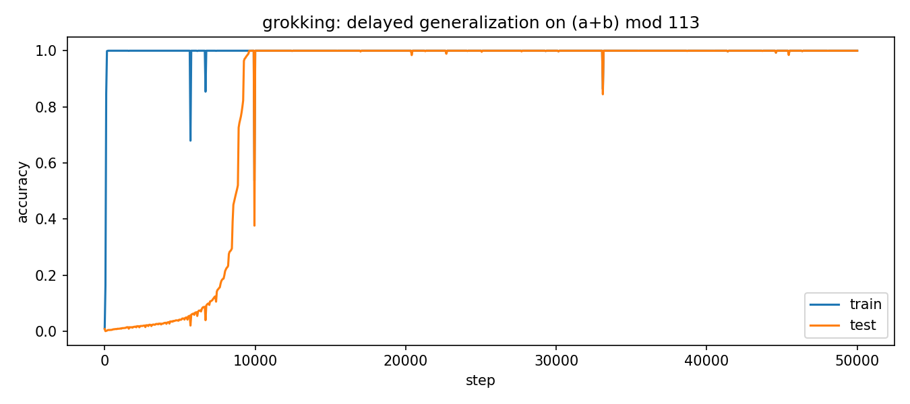
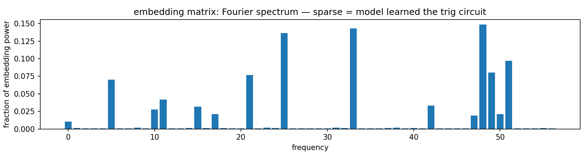
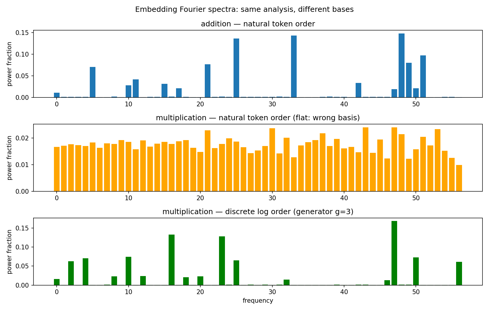

# Grokking

A small transformer trained on modular arithmetic memorizes the training data almost immediately — then sits there, getting every training example right but completely failing on new ones, for thousands more steps. Then something clicks. Test accuracy jumps from near-zero to 100% in what looks like a phase transition.

This repo reproduces that phenomenon and then opens up the model to ask: *what actually changed inside?*

---

## The training curve



Blue is training accuracy, orange is test. The model memorizes around step 1000 and stays there. Test accuracy barely moves for ~10,000 more steps, then sweeps up to 100% in a few hundred steps.

The gap between memorization and generalization is the grokking phenomenon (Power et al. 2022). The question is what the model was building during those 10,000 steps where nothing visible was happening.

---

## What the model learned

After grokking, the embedding matrix — the vectors the model uses to represent each number — has a specific structure. Running a Fourier transform over the 113 token embeddings reveals it:



Almost all the power sits at a handful of frequencies. The rest is near zero.

This is the fingerprint of a specific algorithm. To compute `(a + b) mod 113` with a neural network, a lookup table won't generalize. But there's a mathematical approach that does: represent each number as a combination of sine and cosine waves, then use the trig identity

```
cos(w(a+b)) = cos(wa)·cos(wb) - sin(wa)·sin(wb)
```

to compute the sum. A few Fourier frequencies are all you need, and the MLP can recover the answer from the resulting signal. That's what the sparse spectrum is showing — the model found this exact representation independently, just from gradient descent on arithmetic problems.

---

## Cross-task extension: does multiplication learn the same thing?

Training the same model on `(a × b) mod 113` instead of addition also produces grokking, at roughly the same speed (~10k steps). But the embedding spectrum looks completely different:



- **Top (blue)**: addition in natural token order — sparse, as expected
- **Middle (orange)**: multiplication in natural token order — flat, looks like noise
- **Bottom (green)**: multiplication reordered by discrete logarithm — sparse again

The middle panel looks like the model learned nothing structured. The bottom panel shows it did — just in a different mathematical basis.

For multiplication mod a prime, the relevant algebraic structure is the *multiplicative* group Z/112Z, not the additive group Z/113Z. The natural way to "line up" the tokens for this group isn't 1, 2, 3, ..., 112 — it's in powers of a generator: 3¹, 3², 3³, ... mod 113. Under that ordering (discrete log order, g=3 for p=113), multiplication becomes addition, and the same Fourier analysis reveals the same kind of sparse structure.

Both models found the algebraically natural representation for their respective operations. The structure was always there in the multiplication model — it was just invisible from the wrong angle.

---

## Running it

```bash
pip install -r requirements.txt

python train.py add   # trains on (a+b) mod 113
python train.py mul   # trains on (a×b) mod 113

python analysis.py    # generates all plots
```

Training takes ~15 minutes per run on a laptop (MPS/CPU). Checkpoints are saved every 1000 steps so you can inspect intermediate states.

---

## Files

| File | Description |
|------|-------------|
| `model.py` | One-layer transformer (~100k params) |
| `train.py` | Dataset generation, training loop, checkpointing |
| `analysis.py` | Fourier probes, training curves, discrete log reordering |
| `diagnose.py` | Sanity checks on data splits and checkpoint accuracy |

---

## References

- Power et al. 2022 — [Grokking: Generalization Beyond Overfitting on Small Algorithmic Datasets](https://arxiv.org/abs/2201.02177)
- Nanda et al. 2023 — [Progress Measures for Grokking via Mechanistic Interpretability](https://arxiv.org/abs/2301.05217)
